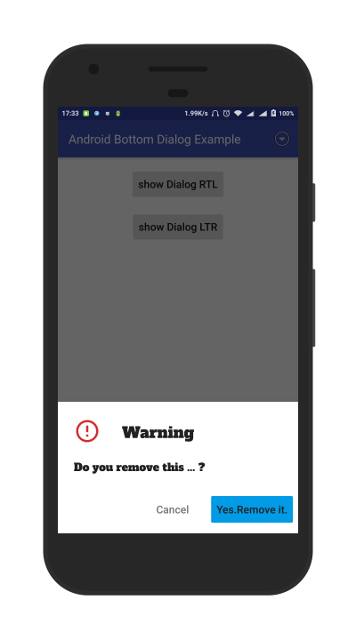
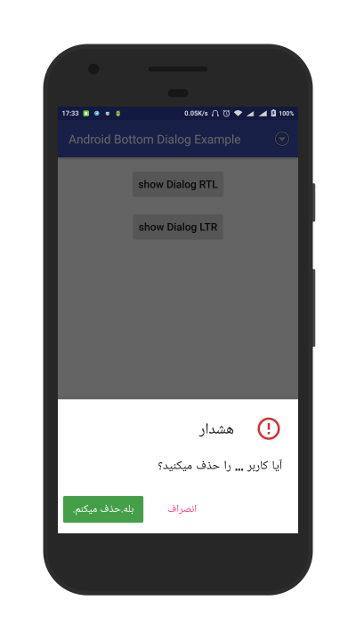

# **Android Bottom Dialog**

A customizable Android library to display bottom dialog.
It Supports LTR/RTL directions.
All parameters are customizable.


## **Version**
1.0.0
### **Requirements**

- MIN-SDK Version = 15

### **Install**
	dependencies {
	        compile 'com.github.Mojtaba-Shafaei:AndroidBottomDialog:v1.0.0'
	}


[](https://jitpack.io/#Mojtaba-Shafaei/AndroidBottomDialog)

### **Screenshots**





### **Sample code**

```java
BottomDialog.builder()
    .withIcon(R.drawable.ic_error_outline_red_700_24dp)

    .withTitle("Warning", typeface, R.dimen.titleTextSize)
    .withContent("Do you remove this ... ?", typeface, R.dimen.contentTextSize)

    .withPositiveText("Yes.Remove it.", R.color.textPrimaryColor)
    .withPositiveBackgroundType(BottomDialog.BLUE)

    .withNegativeText("Cancel", R.color.textSecondaryColor)
    .withNegativeBackgroundType(BottomDialog.TRANSPARENT)
    .build()
    .show(MainActivity.this);
```
<!-- ## **Sample App**
[Download sample app from my drive](https://drive.google.com/file/d/0B7U-LJJvftlSZC1qRDcxeVV3N3M/view?usp=sharing) -->

## **Developer**

* **Mojtaba Shafaei** [Email](mjtb.shafaei@gmail.com)

## **License**
This project is licensed under the MIT License
